# Workout Planner

## Warning

An incredible amount of this project has been vibe coded. Here there be dragons not of my design. You have been warned

## Details

A feature-rich React application for planning workouts, exploring exercises, and timing circuit training sessions. Built with an interactive muscle diagram, comprehensive exercise library, and smart workout generation.

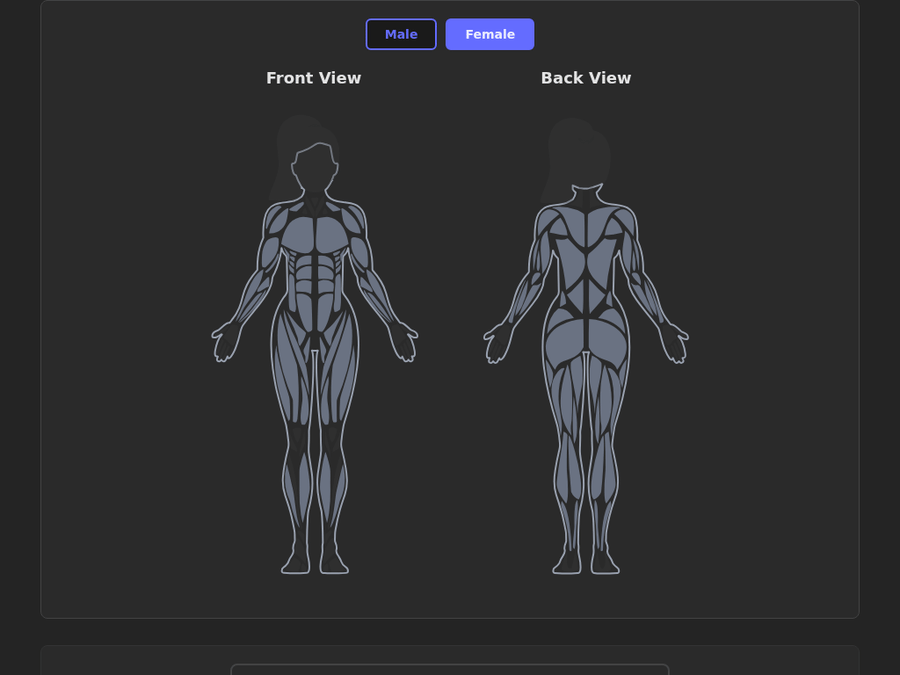

## Features

- **Interactive Muscle Diagram** - Click muscles to filter exercises, toggle male/female body models
- **Exercise Library** - Search and filter 200+ exercises by muscle group or equipment
- **Add to Plan** - Quickly add exercises to plans with customizable sets, reps, weight, and rest
- **Workout Plans** - Create, edit, and manage custom workout plans with drag-drop reordering
- **Random Workout Generator** - Generate workouts based on muscle group quotas with pin/reroll
- **Circuit Timer** - Full-featured interval timer with sound alerts and keyboard controls
- **Dark/Light Theme** - Automatic OS preference detection with manual toggle
- **Offline-First** - All data persists in localStorage with cross-tab sync

---

## Interactive Muscle Diagram


Click any muscle on the interactive anatomical diagram to instantly filter exercises targeting that muscle group. Toggle between male and female body models, and view both front and back perspectives. Hovering over exercises highlights the corresponding muscles on the diagram, and vice versa.

<p align="center">
  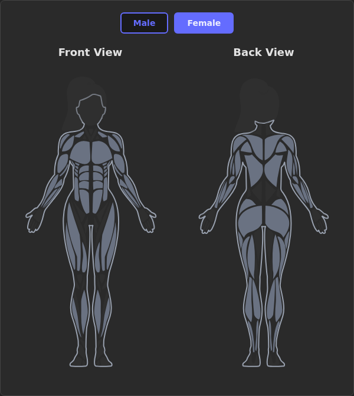
  
</p>

---

## Exercise Library


Browse a comprehensive exercise database with powerful filtering. Search by name, click muscle group tags, or filter by required equipment. Each exercise includes detailed information: target muscles, equipment needed, description, and embedded YouTube tutorial videos.

<p align="center">
  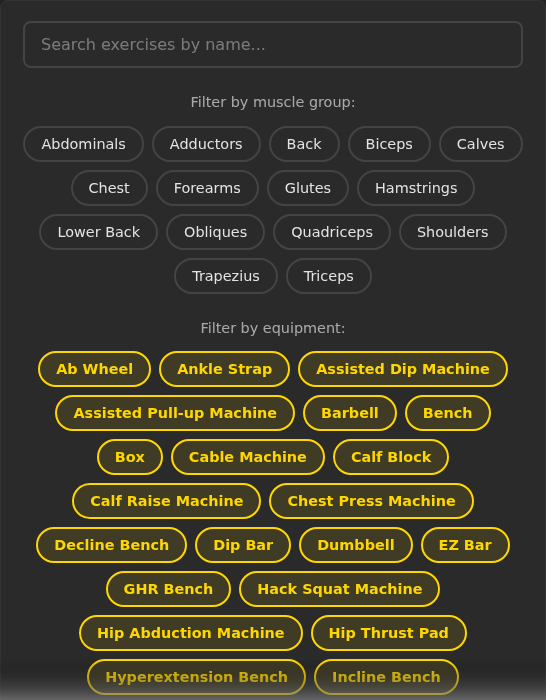
</p>

<p align="center">
  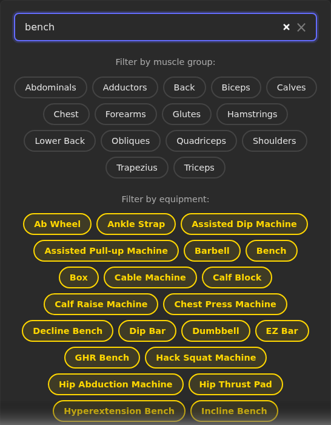
  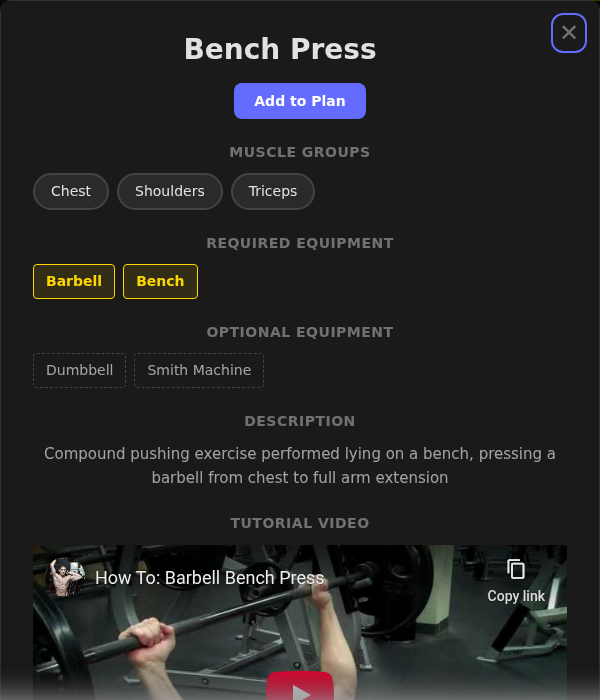
</p>

---

## Add Exercises to Plans

Quickly add exercises from the library to your workout plans. Hover over any exercise card to reveal a "+" button, or use the "Add to Plan" button in the exercise detail modal. Choose from:

- **Quick Add** - Add with default settings (3 sets x 8-12 reps)
- **Customize** - Configure sets, reps, weight, and rest periods before adding
- **Create New Plan** - Start a fresh workout plan with the selected exercise

---

## Workout Plans


Create and manage custom workout plans with full control over sets, reps, weight, and rest periods. **Drag and drop plans to reorder them** in your list. Enable circuit mode to organize exercises into rounds with drag-and-drop reordering within the plan. All plans persist in localStorage with cross-tab synchronization.

<p align="center">
  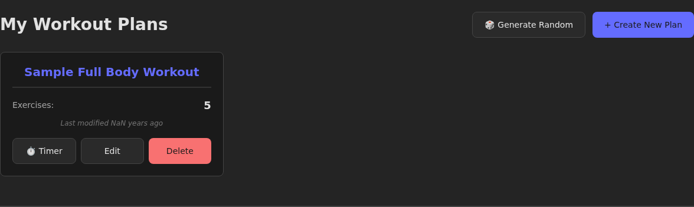
</p>

<p align="center">
  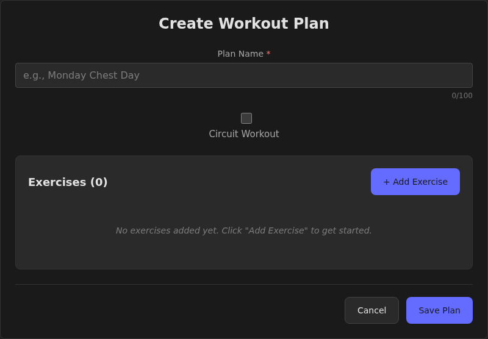
</p>

---

## Random Workout Generator

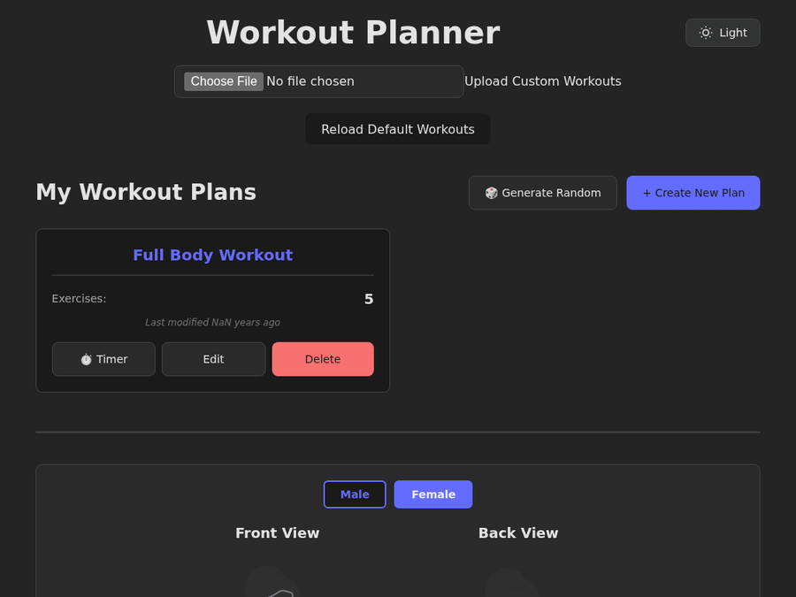

Generate randomized workouts based on muscle group quotas. Specify how many exercises you want for each muscle, then generate a balanced workout. Pin exercises you want to keep and reroll others. Save your favorite quota configurations as templates for quick generation.

<p align="center">
  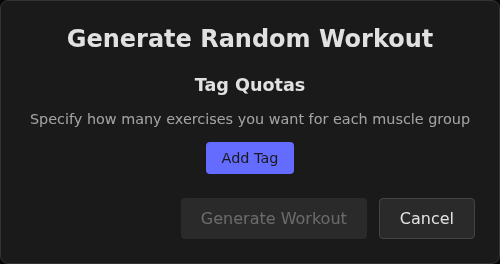
</p>

---

## Circuit Timer

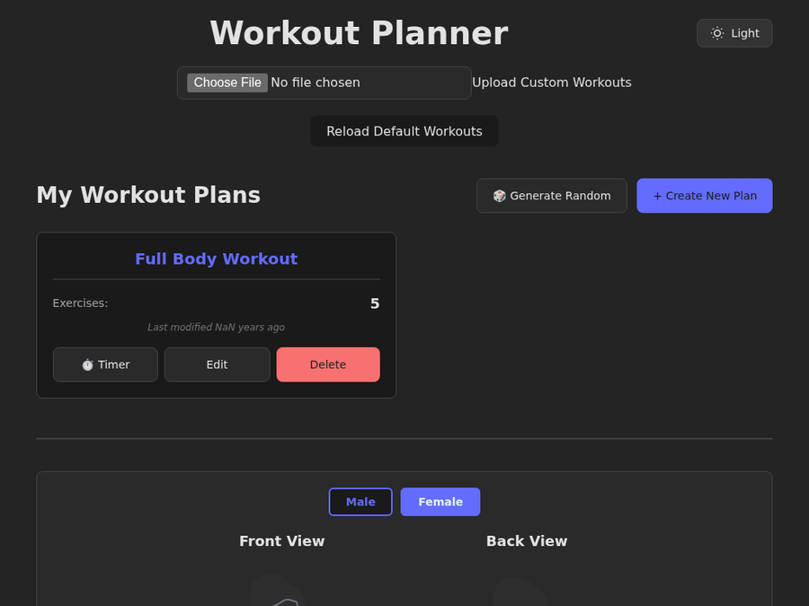

Time your circuit workouts with a full-featured interval timer. Configure exercise duration, rest periods, and number of rounds. Choose from 9 sound presets with adjustable volume. Control with keyboard shortcuts: Space to pause/resume, Escape to stop, Enter to start.

<p align="center">
  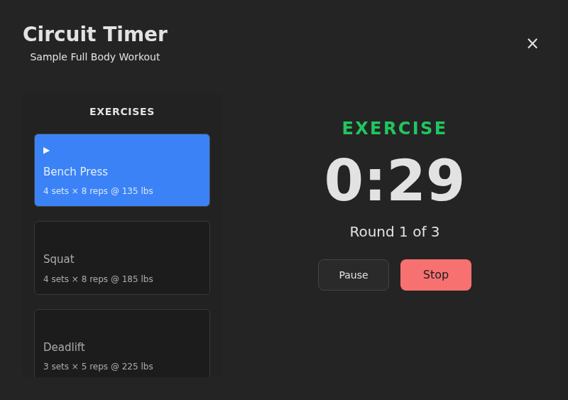
</p>

---

## Theme Support


Switch between dark and light themes with a single click. The app automatically respects your OS color scheme preference on first load.

<p align="center">
  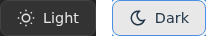
</p>

---

## Getting Started

This project uses **Bun** as the package manager and runtime.

### Install Dependencies

```bash
bun install
```

### Run Development Server

```bash
bun dev
```

The application will be available at `http://localhost:5173`

### Build for Production

```bash
bun run build
```

### Preview Production Build

```bash
bun run preview
```

---

## CSV Format

The app loads exercises from CSV files. You can use the included default exercises or upload your own:

```csv
Exercise,Muscle Group,Description,Equipment,Optional Equipment,YouTube URL
Bench Press,"Chest, Shoulders, Triceps",Compound pushing exercise,Barbell;Bench,Dumbbells;Smith Machine,https://youtube.com/...
```

---

## Technologies Used

- **React 18** - UI framework with hooks
- **Vite** - Build tool with HMR
- **PapaParse** - CSV parsing
- **@mjcdev/react-body-highlighter** - Interactive muscle diagram
- **Bun** - Package manager and runtime
